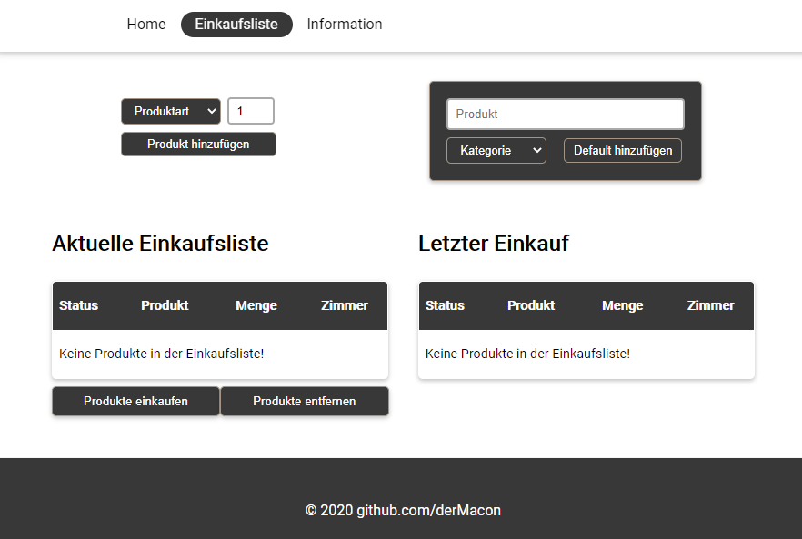
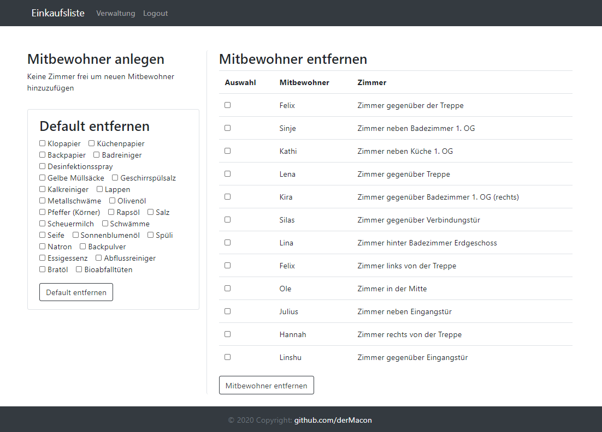
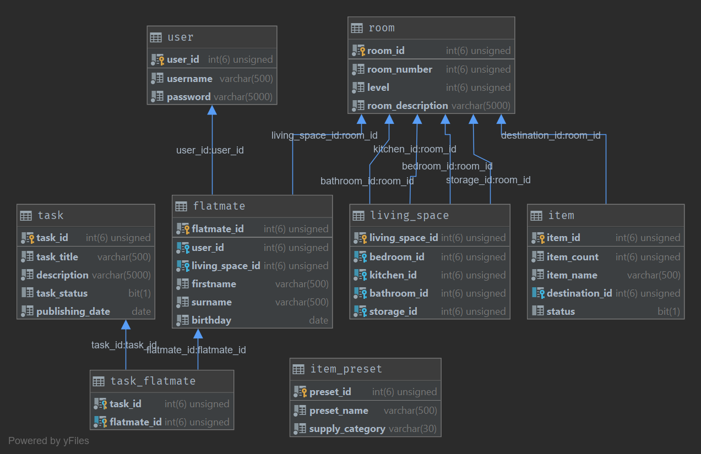

# flat-organizer
Fullstack webapp used for coordination with roommates in larger flats.

Feel free to test the following dummy project.
* Live Server (Dummy): http://168.119.120.2:8080/flat-organizer-demo/groceryList/
    * user: *user1*
    * password: *surname0101*

In our flat every roommate has a specific set of chores he / she has to do. This webapp should help organize those chores. In the current version it's mainly used to implement a grocery list to which each roommate can add products. The roommate who does the grocery shopping for the flat can see to which storage room all the products should be delivered via the destination column in the tables shown below. This destination will be generated automatically by the system depending on the room location of the user putting the item in the list. Each item has an assigned category and storage place depending on the level of the bedroom of the flatmate that has put the item on the list. If a new input item is already present on the list, the system will update the item count of the already present item.

On the admin page it is possible to remove an user from the app and modify the item defaults (category, etc.).

## Screenshot

## Frameworks
* Spring Boot
* Hibernate
* Bootstrap 4
* Thymeleaf

## Roadmap
* [x] Setup Apache Server
* [x] Setup mySql Database Server
* [x] Create database schema
* [x] Create Spring dummy project
   * deploy it on server
* [x] Grocery list backend
* [x] Secure form login (spring security starter)
* [x] Thymeleaf template frontend
* [x] Admin page back- / Frontend (Bootstrap)
* [x] Present project to roomates (first official release)
* [x] Create demo version for showcasing
   * [ ] Update main page with bootstrap components
* [x] Hash Passwords (BCrypt)
* [ ] Create secure endpoints (JWT)
* [x] Create Flutter demo app
* [ ] Create Flutter mobile app

## Database Schema

### ⚠️ Incomplete configuration
* For privacy reasons the [data set](./secure-webapp/src/main/resources/data.sql) for the database may be incomplete in this public repository.
* The [credentials](./secure-webapp/src/main/resources/application.properties) for the database must also be filled out before the application can start. 
